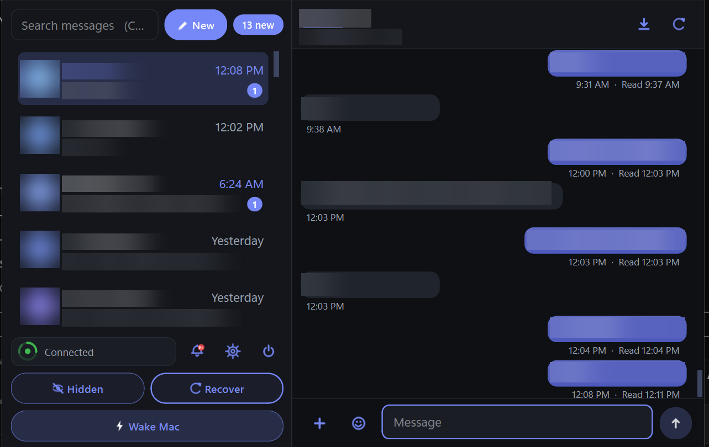

# JRL Messages

**A reliability-first iMessage client for Windows. Bring your own Mac.**

JRL Messages is a native Windows desktop application (Python 3.12 + PySide6) that gives you full iMessage on a PC: blue bubbles, group chats, attachments, tapbacks, verification-code popups, and desktop notifications. It works by relaying through a Mac you own, running the open-source [BlueBubbles](https://bluebubbles.app) server, reached privately over [Tailscale](https://tailscale.com).

It was built by a practicing lawyer for one reason: **not missing a message matters.** Every architectural decision in this project flows from that requirement, and the result is a client that is unusually aggressive about completeness, self-healing, and honest failure reporting.

Current release: **v3.6.0**. Test suite: **234 unit tests, all passing**, plus four end-to-end harnesses.

**[Documentation, screenshots and diagrams &rarr;](https://crypto-frog.github.io/jrl-messages/)**



<sub>Contact names, numbers and message text are redacted in every screenshot.</sub>

---

## Why this exists

Apple does not make iMessage for Windows. The workarounds each have problems:

- **Cloud "Mac in the sky" services** put your Apple ID and every private message on someone else's hardware.
- **Protocol reverse-engineering** (the Beeper approach) gets shut down by Apple.
- **Microsoft Phone Link** offers a limited iMessage bridge with no history, no group support, and frequent silent gaps.

The remaining honest architecture is the one this project uses: your own Mac, signed into your own Apple ID, acting as a relay you control end to end. That costs a second machine. In exchange you get something no cloud service can promise: nobody but Apple and you ever touches your messages, and every link in the chain is yours to inspect and repair.

## How it works

```
iPhone  <-->  Apple's cloud  <-->  Mac (Messages.app + BlueBubbles server)
                                        |
                                   Tailscale (private WireGuard mesh)
                                        |
                              Windows PC: JRL Messages
                              +---------------------------+
                              |  Agent (background)       |
                              |  sync, watchdog, outbox,  |
                              |  notifications, SQLite    |
                              +---------------------------+
                              |  Window (foreground)      |
                              |  viewer and composer      |
                              +---------------------------+
```

The Windows side is split into **two processes** (since v3.0.0):

- The **agent** (`run_agent.py`) is a headless background process that starts at logon and never depends on the window. It owns every network connection, the reconciliation engine, the notification pipeline, the outbox, and all database writes. A supervisor, a Startup entry, and an hourly failsafe keep it alive.
- The **window** (`run.py`) is a pure viewer and composer. It talks to the agent over a local pipe with a versioned handshake. If the window crashes or is closed, messages keep arriving, keep being recorded, and keep raising notifications.

This separation is the heart of the reliability story: the pipeline that receives your messages has no UI code in its failure domain.

Full detail: [the architecture page](https://crypto-frog.github.io/jrl-messages/architecture.html)

## What you need

| Piece | Requirement |
|---|---|
| Windows PC | Windows 10 or 11, Python 3.12 from python.org |
| A Mac | Any Mac that runs a supported macOS, signed into your Apple ID, Messages working. It stays home, plugged in, lid closed is fine |
| BlueBubbles | The free server app on the Mac (LAN URL mode; no Firebase or Cloudflare needed) |
| Tailscale | The free tier, installed on both the Mac and the PC, same account |
| iPhone | Your normal phone, anywhere in the world |
| Optional | A Bluetooth LE adapter on the PC and Microsoft Phone Link, only for the experimental iPhone notification mirroring feature (see Known issues) |

## Installing

Short version:

1. Set up the Mac once: Messages signed in, BlueBubbles server installed, Tailscale connected. The `mac/` folder ships a keepalive installer that hardens the Mac against sleep and App Nap. Guide: [MAC-SETUP.md](MAC-SETUP.md)
2. On the PC: install Python 3.12 and Tailscale, extract this project to a folder, and double-click **`install.bat`**. It creates a private virtual environment, installs dependencies, registers the background agent to start at every logon, and starts it.
3. Launch with **`JRL-Messages.bat`**, open Settings, and enter the Mac's Tailscale address and the BlueBubbles server password. The password is stored in Windows Credential Manager via `keyring`, never in a file.

The complete, carefully written walkthrough (including first-run checks, daily use, and troubleshooting) is [SETUP.md](SETUP.md).

## What it does

- **Complete history sync** with a ROWID-window reconciliation engine that survives iCloud inserting old-dated messages days later, transient short reads, and server restarts. Fixed numeric windows, tail audits, deep wall-clock audits, and a rolling archive repair pass mean gaps get found and filled.
- **Wake Mac**: Apple's Messages.app sometimes holds messages upstream when it goes idle. The agent detects the signature of that state and performs a verified repair by restarting the Messages connection on the Mac through BlueBubbles. What used to be a mystery ("texts only show up after I send one") is handled automatically.
- **Self-healing**: a watchdog rebuilds network workers after repeated failures, the supervisor restarts a dead agent, and the window reattaches cleanly.
- **Real notifications**: rich popups with Copy and Fill buttons for verification codes, an in-app notification center (the bell), configurable sounds, and storm protection so a reconnect burst never floods your screen.
- **Full conversation features**: group chats, multi-recipient compose, attachments with EXIF-corrected thumbnails, a built-in image viewer, an emoji picker, tapback display, unread tracking with a clickable pill, conversation hiding with undo, per-conversation drafts, and whole-conversation transcript export to plain text (Ctrl+E).
- **Away-from-home use**: the PC can be a laptop anywhere in the world; Tailscale makes the Mac reachable as if it were on the same desk.

## Known issues, stated plainly

### Experimental: iPhone notification mirroring over Bluetooth (unreliable)

Since v3.3.0 the app can additionally mirror your iPhone's own notification banners (from any app on the phone) to the PC, using Apple's Notification Center Service (ANCS) over Bluetooth LE, riding the pairing bond that Microsoft Phone Link creates.

**Honest status: it sometimes works, and most of the time it does not.** iPhones rotate anonymous Bluetooth addresses, publish ANCS intermittently and only toward connections they trust, and Windows caches stale GATT data. The current code (see the 3.3.x through 3.5.x release notes for the full campaign) handles address rotation, sidelining, cache bypass, and paired-list authority, and it is still not dependable. This is the project's primary open problem and the best place for a contributor with Bluetooth LE and Windows.Devices experience to make a difference.

**What this does and does not limit:**

- It **does not** affect messaging at all. Message sync, sending, receiving, notifications for iMessage and SMS, history, and every core feature travel over the Mac relay path, which has nothing to do with Bluetooth. The app is a complete, dependable iMessage client with this feature turned off, and it ships off by default.
- It **does** mean you cannot yet count on seeing your iPhone's other notifications (banking apps, calendars, third-party messengers) mirrored on the PC. For those, Microsoft Phone Link itself remains the fallback.

Deep technical write-up and contribution guide: [the known-issues page](https://crypto-frog.github.io/jrl-messages/known-issues.html)

### Other limits

- Green-bubble SMS physically routes through your iPhone, so SMS requires the phone powered on with service somewhere. iMessage does not.
- Some group-management actions depend on BlueBubbles' Private API mode on the Mac.
- The two-machine requirement is structural, not incidental. This project deliberately does not attempt Apple-protocol reverse-engineering.

## Development and testing

The codebase is test-pinned to an unusual degree: nearly every field-reported bug in the release notes has a regression test named after it. The suite runs headless on any OS (Bluetooth modules import lazily and are exercised through fakes):

```
# Windows
set QT_QPA_PLATFORM=offscreen
set JRL_SMOKE=1
.venv\Scripts\python -m unittest discover -s tests

# macOS / Linux
QT_QPA_PLATFORM=offscreen JRL_SMOKE=1 python -m unittest discover -s tests
```

Four heavier harnesses in `tools/` run the full pipeline against a mock BlueBubbles server, including an offscreen end-to-end GUI run. See [CONTRIBUTING.md](CONTRIBUTING.md) for the development workflow and the project's pinned invariants (behaviors that must never regress).

## History

The `RELEASE-NOTES-*.txt` files are preserved verbatim from the project's private development, written release by release as field reports came in. They are unusually candid engineering documents: each one names what broke, what the screenshot or log proved, and what was pinned so it cannot break again. A condensed history is in [CHANGELOG.md](CHANGELOG.md).

## Contributing

Issues and pull requests are welcome. Bug reports with the app version (title bar), the Activity log ("Copy all"), and a screenshot are gold; the issue templates walk you through it. There is a dedicated template for Bluetooth pairing reports because that data directly advances the project's hardest open problem.

Please read [CONTRIBUTING.md](CONTRIBUTING.md) and the [Code of Conduct](CODE_OF_CONDUCT.md).

## Security and privacy

This application relays your personal messages. Read [SECURITY.md](SECURITY.md) before filing anything that includes logs, and report vulnerabilities privately.

## License

[MIT](LICENSE)
